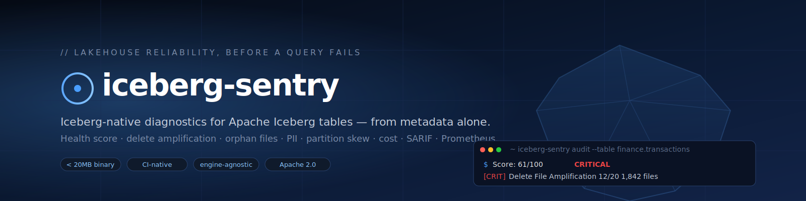
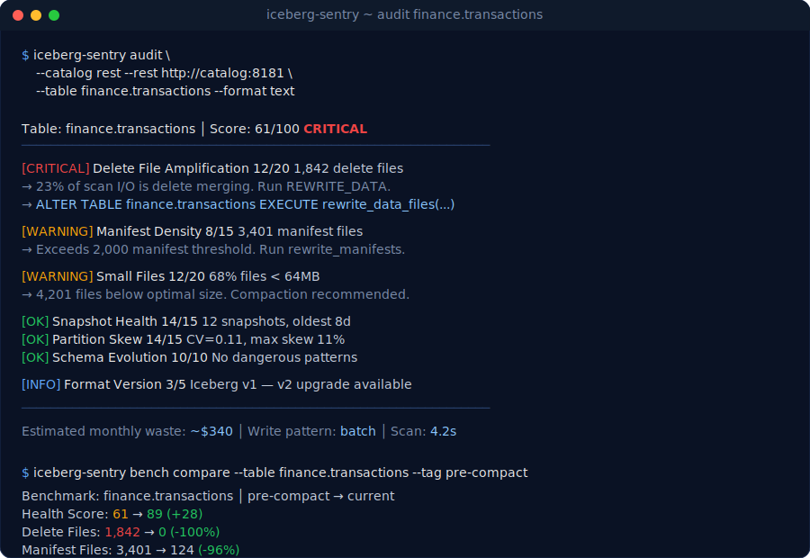

<p align="center">
  <a href="https://github.com/jaybilgaye/iceberg-sentry">
    
  </a>
</p>

<h1 align="center">
  Iceberg Sentry
</h1>

<p align="center">
  <b>Iceberg-native lakehouse reliability linter.</b><br>
  Score health, catch delete-file amplification, find orphan storage, sample for PII,<br>
  and gate CI — <em>all from metadata alone</em>. No Spark cluster required.
</p>

<p align="center">
  <a href="https://github.com/jaybilgaye/iceberg-sentry/actions/workflows/ci.yml"></a>
  <a href="https://github.com/jaybilgaye/iceberg-sentry/releases"></a>
  <a href="https://pkg.go.dev/github.com/jaybilgaye/iceberg-sentry"></a>
  <a href="https://goreportcard.com/report/github.com/jaybilgaye/iceberg-sentry"></a>
  <a href="./LICENSE"></a>
  <a href="https://github.com/jaybilgaye/iceberg-sentry/stargazers"></a>
</p>

<p align="center">
  <a href="https://jaybilgaye.github.io/iceberg-sentry/docs/"><b>Docs</b></a> ·
  <a href="https://jaybilgaye.github.io/iceberg-sentry/docs/quickstart.html"><b>Quickstart</b></a> ·
  <a href="https://jaybilgaye.github.io/iceberg-sentry/examples.html"><b>Examples</b></a> ·
  <a href="./Iceberg_Sentry_Spec_v2.md"><b>Spec</b></a> ·
  <a href="https://github.com/jaybilgaye/iceberg-sentry/discussions"><b>Discussions</b></a> ·
  <a href="https://github.com/jaybilgaye/iceberg-sentry/releases"><b>Releases</b></a>
</p>

<p align="center">
  <sub>Docs live at <a href="https://jaybilgaye.github.io/iceberg-sentry/"><code>jaybilgaye.github.io/iceberg-sentry</code></a>, published by the <a href="./.github/workflows/pages.yml">Pages workflow</a> from the <a href="./site/"><code>site/</code></a> directory. One-time setup: <em>Settings → Pages → Source: GitHub Actions</em>. Or read locally with <code>make site-serve</code>.</sub>
</p>

```
                                                                          .
    ⌬  iceberg-sentry            ▁                                      ▁    ▁
                              ▁▂▄█▇▂▁▁            "Day 2" for Iceberg  ▄█▇▂  ▄█▆
                          ▁▂▄▆████████▆▂▁            starts here.    ▄█████████▂
   the tip you see  ─▶   ▂█████████████████▂
   ═════════════════════════════════════════════════════════════════════════════
   the 85% below      ─▶   ~~~ metadata bloat · delete amplification · orphans ~~~
   is where queries         ~~~ partition skew · untagged PII · dark storage ~~~
   go to die.               ~~~ HDFS→cloud landmines · runaway snapshot chains ~~~
   ═════════════════════════════════════════════════════════════════════════════
```

---

## Install

<table>
<tr>
<td>

```sh
# macOS / Linux
curl -sSL https://raw.githubusercontent.com/jaybilgaye/iceberg-sentry/main/scripts/install.sh | sh
```

</td>
<td>

```sh
# Docker (multi-arch)
docker pull ghcr.io/jaybilgaye/iceberg-sentry:latest
```

</td>
</tr>
<tr>
<td>

```sh
# From source
go install github.com/jaybilgaye/iceberg-sentry/cmd/iceberg-sentry@latest
```

</td>
<td>

```sh
# Pinned release archive
gh release download v0.3.0 --repo jaybilgaye/iceberg-sentry \
  --pattern 'iceberg-sentry_*_linux_x86_64.tar.gz'
```

</td>
</tr>
</table>

## See it work

<p align="center">
  
</p>

## Why it exists

Apache Iceberg solved ACID on object storage. Nobody built the tooling to keep those tables healthy over time. Teams running production lakehouses — on Cloudera CDP, Databricks Unity, AWS Glue, or bare REST Catalog — hit the same "Day 2" failures on repeat:

| Problem                        | Symptom                                                   |
| ------------------------------ | --------------------------------------------------------- |
| **Metadata bloat**             | 10× jump in `LIST` API costs; queries stall on cold cache |
| **Delete-file amplification**  | Reads slow silently until every query merges deletes      |
| **Orphan files**               | Object-store bill grows for data no query can reach       |
| **Untagged PII**               | Ranger/Atlas/Unity policies protect nothing they can't see|
| **Partition skew**             | One hot partition kills executor memory                   |
| **HDFS→cloud migrations**      | Absolute `hdfs://` paths break silently after cutover     |

Everything above is diagnosable from **metadata alone**. Iceberg Sentry is that diagnosis — a single 20 MB static binary you can run from a laptop, a CI job, or a Kubernetes CronJob.

## What you get

<table>
<tr>
<td width="33%" valign="top">

**⌬  Table health score**
Six weighted dimensions rolled into 0–100. Every failing dimension carries a `SQL` remediation command.

</td>
<td width="33%" valign="top">

**⌬  Delete-file amplification**
First-class v2 diagnostic. Counts position vs. equality deletes; predicts read amplification before queries get slow.

</td>
<td width="33%" valign="top">

**⌬  Orphan-file discovery**
Bloom-filter-backed differential scan. Dry-run by default. Grace period excludes in-flight writes.

</td>
</tr>
<tr>
<td valign="top">

**⌬  PII scanner**
Parquet row-group sampler with regex + Shannon-entropy detection for emails, Luhn-valid cards, SSNs, API keys. **Zero-disk persistence.**

</td>
<td valign="top">

**⌬  Partition skew**
Coefficient of variation across per-partition bytes. Names hot and sparse partitions.

</td>
<td valign="top">

**⌬  Write-pattern classifier**
Streaming / batch / mixed from the trailing snapshot history. Auto-relaxes file-size thresholds for Flink tables.

</td>
</tr>
<tr>
<td valign="top">

**⌬  SARIF for GitHub**
`--format sarif` uploads natively to the GitHub Security tab. Every failing dimension becomes a Code Scanning result.

</td>
<td valign="top">

**⌬  Prometheus native**
One-shot `--push-gateway` or long-lived `/metrics` server. Ships with a ready-to-import Grafana dashboard.

</td>
<td valign="top">

**⌬  HDFS → CDP audit**
Migration Readiness — flags absolute paths, HDFS-specific properties, v1 tables. Per-table `LOW/MEDIUM/HIGH` risk score.

</td>
</tr>
</table>

## Get started in 60 seconds

```bash
# 1. Install
curl -sSL https://raw.githubusercontent.com/jaybilgaye/iceberg-sentry/main/scripts/install.sh | sh

# 2. Generate a real Iceberg warehouse (pyiceberg-written v2 tables)
pip install "pyiceberg[pyarrow,sql-sqlite]>=0.7.0"
python scripts/gen_fixtures.py --root ./warehouse --clean

# 3. Audit
iceberg-sentry audit \
  --catalog localfs --catalog-root ./warehouse \
  --table fixtures.skewed_v2
```

```
  Table: fixtures.skewed_v2  │  Score: 68/90  CRITICAL
  ─────────────────────────────────────────────────────────────────
  [CRITICAL]   file_size               8/20  100% of files below 32MB
                 → rewrite_data_files (target=512MB) recommended
  [OK]         delete_amplification   20/20  no delete files present
  [OK]         manifest_density       15/15  7 manifest files
  [OK]         snapshot               15/15  7 snapshots; oldest 0m
  [CRITICAL]   partition_skew          5/15  CV=30.12 across 7 partitions (1 hot, 0 sparse)
                 → re-partition hot keys or bucket the partition column
  [OK]         format_version          5/5   Iceberg v2
```

That's the whole workflow. No config file, no compute cluster, no Spark session.

## Commands

<table>
<tr><th align="left" width="140">Command</th><th align="left">What it does</th></tr>
<tr><td><a href="https://jaybilgaye.github.io/iceberg-sentry/docs/audit.html"><code>audit</code></a></td>       <td>Score table health across six dimensions. The one you'll wire into CI.</td></tr>
<tr><td><a href="https://jaybilgaye.github.io/iceberg-sentry/docs/orphans.html"><code>orphans</code></a></td>   <td>Find files in storage that no valid snapshot references.</td></tr>
<tr><td><a href="https://jaybilgaye.github.io/iceberg-sentry/docs/pii.html"><code>pii</code></a></td>           <td>Stream-sample Parquet row groups for PII. Zero disk persistence.</td></tr>
<tr><td><a href="https://jaybilgaye.github.io/iceberg-sentry/docs/bench.html"><code>bench</code></a></td>       <td>Capture a baseline; compare after maintenance. Measures compactions.</td></tr>
<tr><td><a href="https://jaybilgaye.github.io/iceberg-sentry/docs/migration.html"><code>migration</code></a></td><td>HDFS → CDP Public Cloud migration readiness audit.</td></tr>
<tr><td><a href="https://jaybilgaye.github.io/iceberg-sentry/docs/cost.html"><code>cost</code></a></td>         <td>Snapshot cost timeline + cold-tier candidates.</td></tr>
<tr><td><a href="https://jaybilgaye.github.io/iceberg-sentry/docs/export.html"><code>export</code></a></td>     <td>Long-lived Prometheus `/metrics` + `/healthz` server.</td></tr>
</table>

## Wire it into CI

```yaml
name: Iceberg health gate
on: [pull_request, push]
permissions:
  contents: read
  security-events: write   # for SARIF upload

jobs:
  audit:
    runs-on: ubuntu-latest
    steps:
      - uses: actions/checkout@v4
      - name: Install
        run: |
          gh release download v0.3.0 --repo jaybilgaye/iceberg-sentry \
             --pattern "iceberg-sentry_*_linux_x86_64.tar.gz"
          tar -xzf iceberg-sentry_*_linux_x86_64.tar.gz
          sudo install -m0755 iceberg-sentry /usr/local/bin/

      - name: Audit
        run: |
          iceberg-sentry audit \
            --catalog glue --namespace finance \
            --policy sentry.yaml \
            --format sarif > iceberg.sarif

      - uses: github/codeql-action/upload-sarif@v3
        with: { sarif_file: iceberg.sarif, category: iceberg-health }
```

Every failing dimension turns into a GitHub Code Scanning alert with the exact SQL to fix it. Exit codes are stable:

| Code | Meaning |
| :---: | ------- |
| `0` | OK |
| `1` | WARNING surfaced (needs `--fail-on warn`) |
| `2` | CRITICAL — hard fail |
| `3` | Untagged PII detected (`pii` command) |
| `4` | Tool / config error |
| `5` | Catalog or storage connection failure |

## Compared to alternatives

|                                                        | iceberg-sentry | Monte Carlo | OpenMetadata  | Spark `RemoveOrphanFiles` |
| ------------------------------------------------------ | :------------: | :---------: | :-----------: | :-----------------------: |
| Iceberg-native metadata reader                         | ✅             | SaaS-only   | partial       | ✅                        |
| **Delete-file amplification analysis**                 | ✅             | —           | —             | —                         |
| **Partition skew detection**                           | ✅             | via probes  | —             | —                         |
| Shift-left CI integration (SARIF, exit codes)          | ✅             | —           | —             | —                         |
| PII scanner without persisting values                  | ✅             | pipeline    | classifier    | —                         |
| Runs without a compute cluster                         | ✅             | ✅           | ✅             | requires Spark            |
| Self-hosted, single static binary                      | ✅ < 20 MB     | SaaS        | heavy         | JVM                       |
| **Cost**                                               | free (Apache 2.0) | enterprise | open-source  | open-source               |

## Catalogs

<table>
<tr>
<td width="25%" align="center">

**LocalFS**
HadoopCatalog layout
<sub>tests · air-gapped</sub>

</td>
<td width="25%" align="center">

**AWS Glue**
IAM, cross-account STS
<sub>production</sub>

</td>
<td width="25%" align="center">

**Hive Metastore**
Thrift · optional Kerberos
<sub>Cloudera CDP</sub>

</td>
<td width="25%" align="center">

**Iceberg REST**
Polaris · Unity · Nessie · Tabular
<sub>bearer / OAuth2</sub>

</td>
</tr>
</table>

Storage: `s3://`, `hdfs://` (WebHDFS), `file://`. ADLS Gen2 / GCS via S3-compatible endpoints today; native drivers on the roadmap.

## Deploy in Kubernetes

```sh
helm install sentry deploy/helm \
  --set cronjob.enabled=true \
  --set exporter.enabled=true \
  --set serviceMonitor.enabled=true
```

<details>
<summary>What the chart installs</summary>

- CronJob for scheduled audits with Prometheus Pushgateway delivery
- Deployment for the long-lived `/metrics` + `/healthz` exporter
- Service + ServiceMonitor (kube-prometheus-stack compatible)
- ConfigMap holding `sentry.yaml` inline
- ServiceAccount with pod-security defaults (`runAsNonRoot`, `readOnlyRootFilesystem`, dropped capabilities)

Full chart reference: [docs / Deployment](https://jaybilgaye.github.io/iceberg-sentry/docs/deployment.html).

</details>

<details>
<summary>Grafana dashboard preview</summary>

The repo ships [`deploy/grafana-dashboard.json`](./deploy/grafana-dashboard.json) with three panels: Health Score by Table, Critical Findings over Time, Reclaimable Storage.

</details>

## Architecture

<details>
<summary>Deep-scan workflow</summary>

```
┌─────────────────────────────────────────────────────────────────────┐
│                        iceberg-sentry CLI                           │
│                                                                     │
│  ┌─────────────┐   ┌──────────────────┐   ┌───────────────────┐    │
│  │   Policy    │   │  Catalog         │   │   Output          │    │
│  │   Engine    │   │  Resolver        │   │   Formatter       │    │
│  │ (sentry.yaml│   │  (LocalFS/Glue/  │   │  (text/JSON/      │    │
│  │  validator) │   │  Hive/REST)      │   │  SARIF/Prometheus)│    │
│  └──────┬──────┘   └────────┬─────────┘   └────────▲──────────┘    │
│         ▼                   ▼                      │               │
│  ┌────────────────────────────────────────────────┐│               │
│  │              Metadata Parser                   ││               │
│  │  • JSON walker (vN.metadata.json)              ││               │
│  │  • Avro manifest reader (streaming, zero-copy) ││               │
│  │  • Bloom filter: active file set               ││               │
│  │  • Write-pattern classifier                    ││               │
│  └──────────────────────┬─────────────────────────┘│               │
│         ┌───────────────┼──────────────┐           │               │
│         ▼               ▼              ▼           │               │
│  ┌────────────┐  ┌────────────┐  ┌────────────┐    │               │
│  │ Diagnostic │  │ Storage SAL│  │ Cost +     │    │               │
│  │ Engine     │  │ (S3/HDFS/  │  │ Migration  │    │               │
│  │ (health,   │  │  Local)    │  │ modules    │    │               │
│  │ skew, cost)│  │            │  │            │    │               │
│  └────────────┘  └────────────┘  └────────────┘    │               │
│                                                    │               │
│                   Results aggregated ──────────────┘               │
└─────────────────────────────────────────────────────────────────────┘
```

Every scan locks to a specific Iceberg snapshot ID at start — in-flight commits are invisible, giving point-in-time consistency for free.

Performance targets: `< 10s @ 1k manifests`, `< 90s @ 100k`, `< 256 MB RAM` for standard tables, `< 512 MB` at 10M+ files with disk-backed Bloom (Phase 4).

</details>

<details>
<summary>Repo layout</summary>

```
cmd/iceberg-sentry/      CLI entry point (version stamped at build)
internal/
  cli/                   cobra commands: audit, orphans, pii, bench, migration, cost, export
  iceberg/               metadata JSON + Avro manifest parsers
  storage/               local, S3, WebHDFS
  catalog/               LocalFS, Glue, Hive (Thrift+Kerberos), REST (OAuth2)
  scan/                  orchestration engine
  health/                composite scoring, per-dimension diagnostics
  bloom/                 double-hashed Bloom filter
  writepattern/          streaming/batch classifier
  orphans/               differential storage↔metadata scan
  pii/                   Parquet row-group sampler + regex/entropy
  migration/             HDFS → CDP audit
  cost/                  pluggable cost provider + snapshot timeline
  metrics/               Prometheus exposition + push-gateway client
  output/                text · json · SARIF · prometheus renderers
  policy/                sentry.yaml parser
deploy/
  k8s/                   raw CronJob + Deployment + ServiceMonitor
  helm/                  Helm chart
  grafana-dashboard.json
site/                    marketing site + 15-page documentation
scripts/
  gen_fixtures.py        pyiceberg integration fixtures
  install.sh             curl-pipe-safe installer
```

</details>

## Development

```sh
make test           # unit + race
make lint           # gofmt + vet + golangci-lint
make build          # static binary
make fixtures       # pyiceberg-generated Iceberg tables
make docker-dev     # container from source
make bench          # perf benchmarks
```

Go 1.23+ required. No submodules, no codegen — plain `go build`.

## Community

We're building this in the open. All of these are welcome:

- **Ask a question** → [Discussions](https://github.com/jaybilgaye/iceberg-sentry/discussions)
- **Report a bug** → [Open an issue](https://github.com/jaybilgaye/iceberg-sentry/issues/new/choose)
- **Request a feature** → [Feature request template](https://github.com/jaybilgaye/iceberg-sentry/issues/new?template=feature_request.yml)
- **Report a vulnerability** → [Security policy](./SECURITY.md)
- **Contribute code** → [CONTRIBUTING.md](./CONTRIBUTING.md) · [Code of Conduct](./CODE_OF_CONDUCT.md)

If you use Iceberg Sentry in production, we'd love to hear about it — comment on [Discussion #1](https://github.com/jaybilgaye/iceberg-sentry/discussions) with your setup.

## Roadmap

<table>
<tr>
<td valign="top" width="25%">

**Phase 1 — Foundation** ✅
- Iceberg metadata parser
- Streaming Avro manifests
- LocalFS, S3, HDFS storage
- Glue + Hive catalogs
- Health score + policy

</td>
<td valign="top" width="25%">

**Phase 2 — Auditing** ✅
- Orphan discovery + Bloom
- PII scanner (zero-persistence)
- REST catalog
- Partition skew
- Write-pattern classifier
- `bench` compare
- SARIF output

</td>
<td valign="top" width="25%">

**Phase 3 — Cloudera-native** ✅
- Prometheus (`export` + push)
- Migration Readiness Audit
- Snapshot cost timeline
- Atlas health export
- OAuth2 (Polaris / Unity)
- Kerberos HMS
- Helm + K8s manifests

</td>
<td valign="top" width="25%">

**Phase 4 — Community** ▸
- Nessie + branch history
- Slack / PagerDuty alerts
- dbt integration
- OpenMetadata + DataHub
- Hosted SaaS MVP
- Disk-backed Bloom (10M+)

</td>
</tr>
</table>

Full detail in [`Iceberg_Sentry_Spec_v2.md`](./Iceberg_Sentry_Spec_v2.md) and [`CHANGELOG.md`](./CHANGELOG.md).

## Star history

If Iceberg Sentry saved you a compaction firefight, a star tells us to keep going.

<a href="https://star-history.com/#jaybilgaye/iceberg-sentry&Date">
  
</a>

## Thanks

Built on the shoulders of the Apache Iceberg community and the Go ecosystem. Special thanks to:

- **Apache Iceberg** — the spec is why any of this is possible.
- [`hamba/avro`](https://github.com/hamba/avro) — the streaming Avro reader.
- [`aws-sdk-go-v2`](https://github.com/aws/aws-sdk-go-v2) · [`apache/thrift`](https://github.com/apache/thrift) · [`parquet-go/parquet-go`](https://github.com/parquet-go/parquet-go) · [`jcmturner/gokrb5`](https://github.com/jcmturner/gokrb5).

## License

Apache 2.0. See [`LICENSE`](./LICENSE) and [`NOTICE`](./NOTICE).

<p align="center">
  <sub>Built with care for the people who get paged when a table gets slow.</sub><br>
  <sub><a href="https://github.com/jaybilgaye/iceberg-sentry">github.com/jaybilgaye/iceberg-sentry</a>  ·  Apache 2.0  ·  Iceberg v1 / v2 / v3</sub>
</p>
